<h1 align="center"><em>📚 Book Vibes</em></h1>

<p align="center">
  
</p>

<p><em>Book Vibes is a Django-based web application designed to provide users with a seamless online bookstore experience. Users can browse a curated collection of books, add them to their cart, and place orders with ease. The platform aims to enhance the reading journey by offering an intuitive and user-friendly interface.</em></p>

---

## 🧑‍🏫 Faculty & Course Information

- **Faculty:** [Tahmid Taki Rahman](https://cse.uap-bd.edu/faculty/faculty_details/71)

- **Course:** CSE 322 – Software Engineering

---

## 🛠️ Technologies Used

<div align="center">
  
</div>


---

## 🚀 Features

- **User Authentication:** Secure registration and login functionalities.
- **Book Catalog:** Browse books by categories and genres.
- **Search Functionality:** Efficient search to find books quickly.
- **Shopping Cart:** Add or remove books from the cart.
- **Order Management:** Place orders and view order history.
- **E-book Access:** Download available e-books directly.

---

## 📸 Screenshots

### 🏠 Home Page
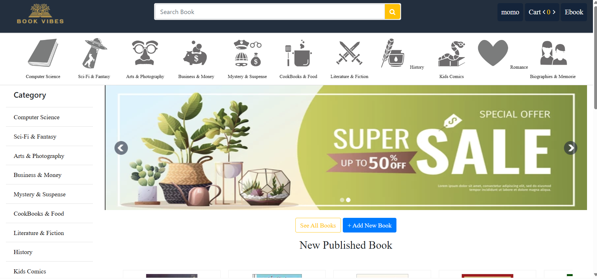

### 🔐 Login Page  
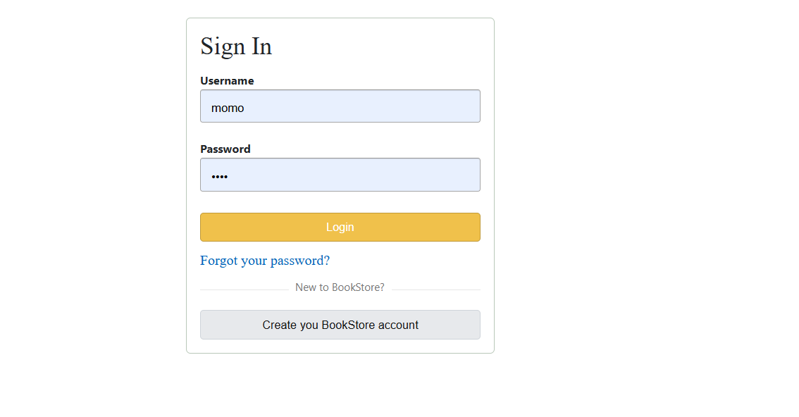

### 📝 Add New Book Option  
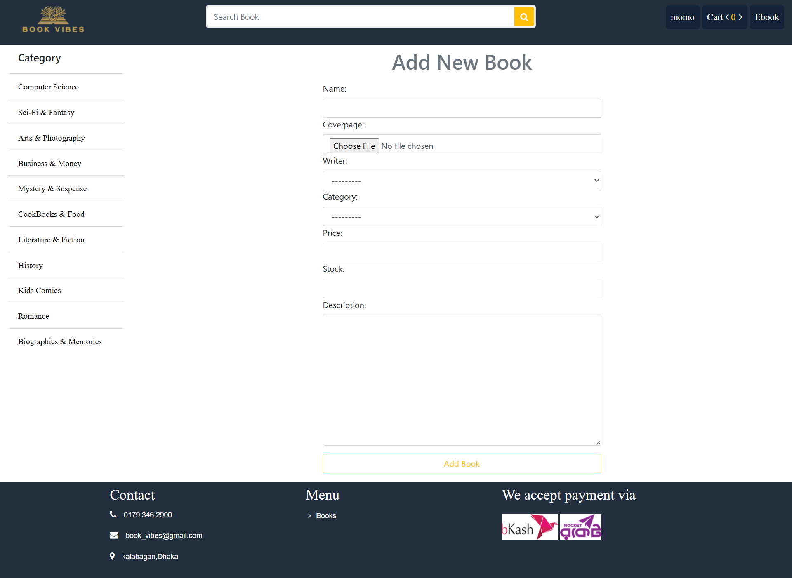

### ⚙️ Admin Site Access  
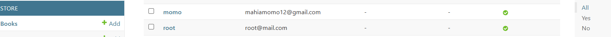

### 📖 Book Details Page  
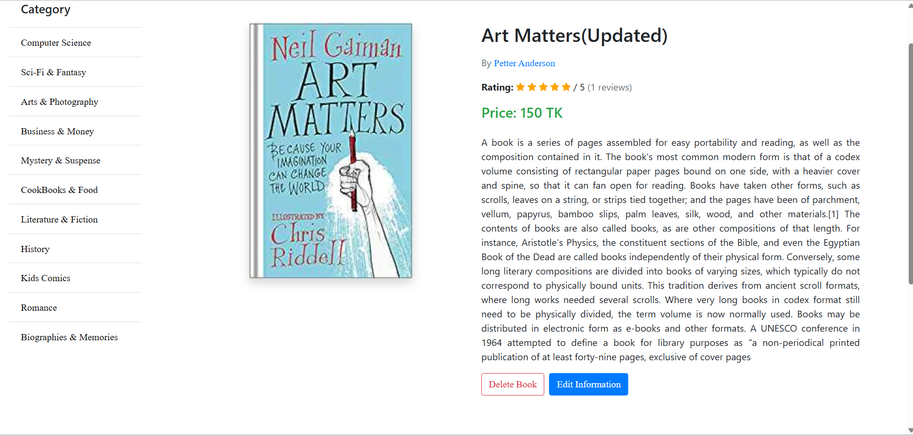 


### 📚 Book Page  
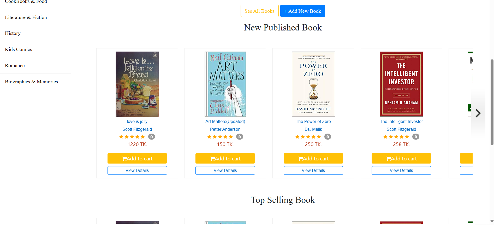 

### 📘 Admin Chapter Read  
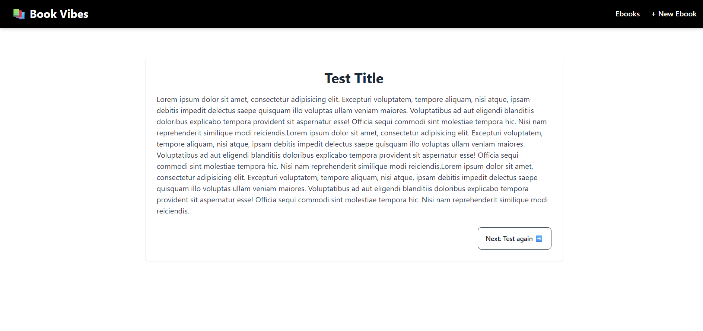

### ➕ Chapter Add  
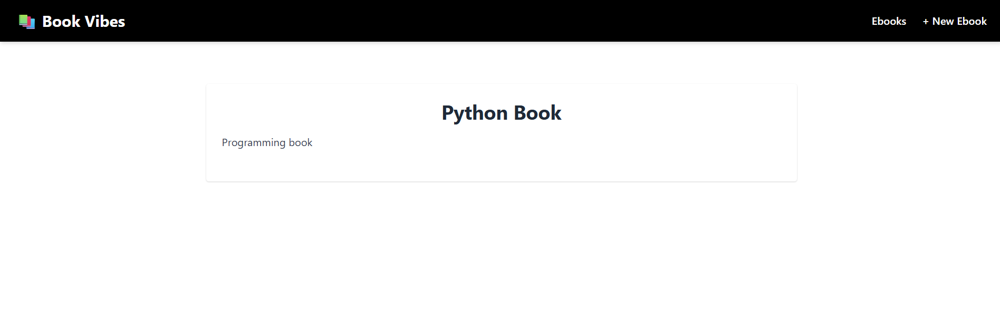

### 📘 Chapter E-Book  
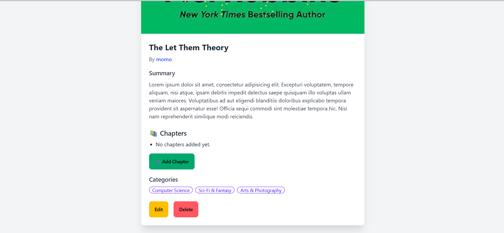

### 🆕 Create Account  
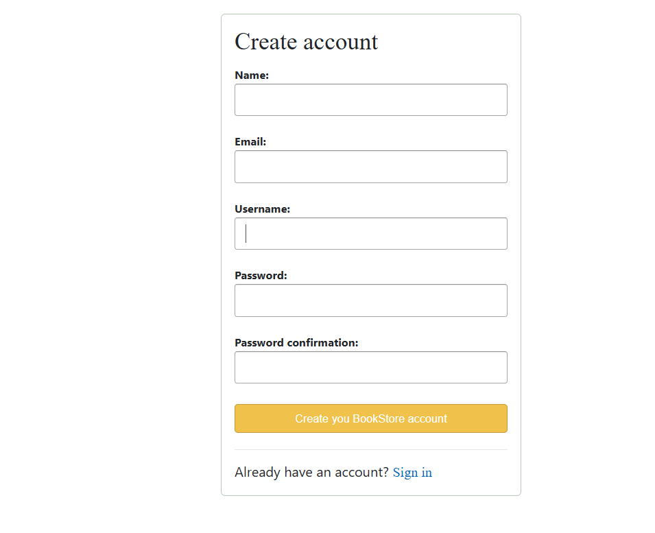

### ❌ Delete Book Option  
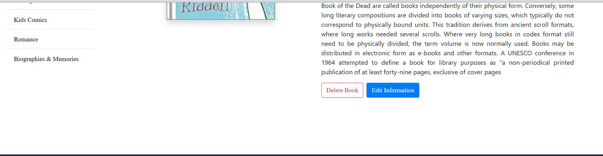

### 📥 E-book Add New Book  
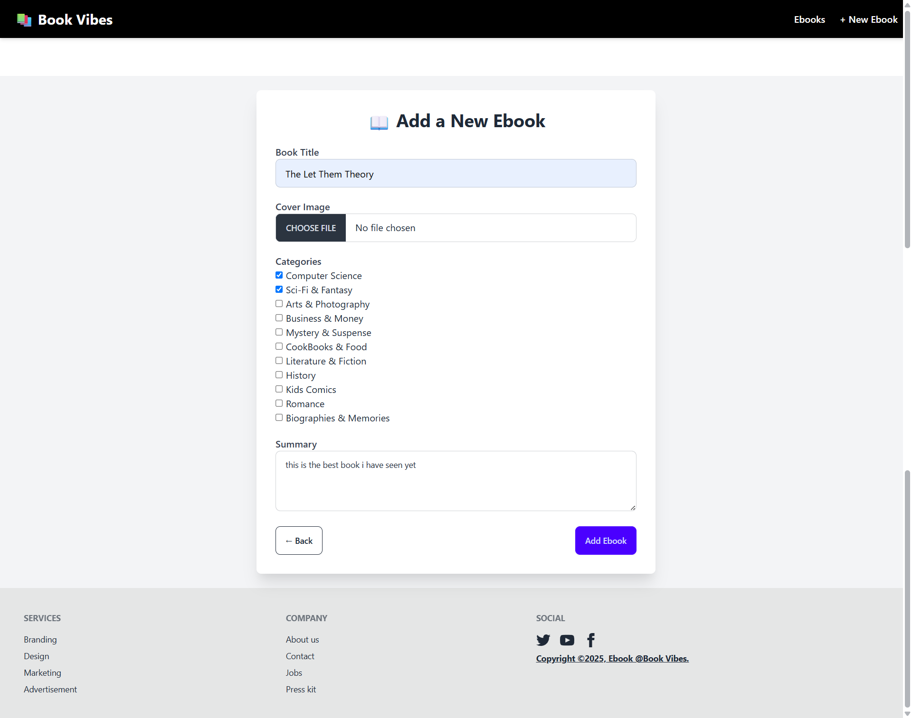

### 🏠 E-book Homepage  
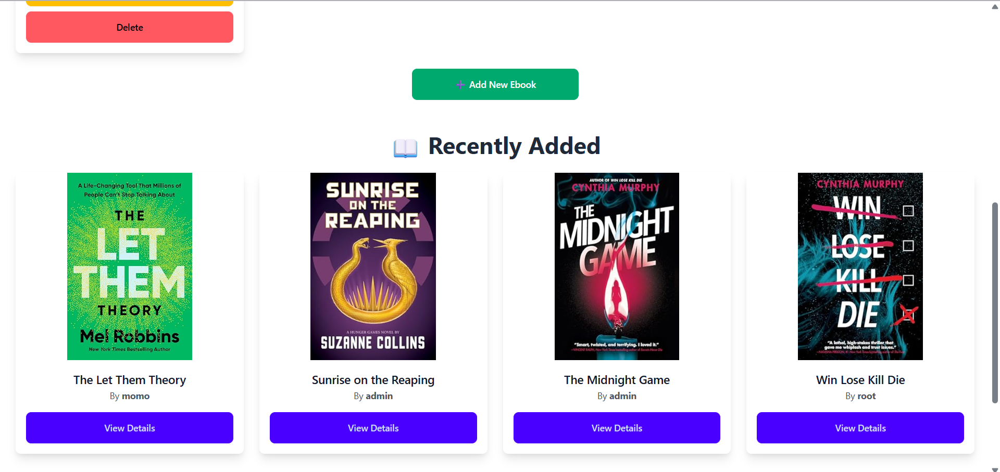

### 📝 Edit Book Info  
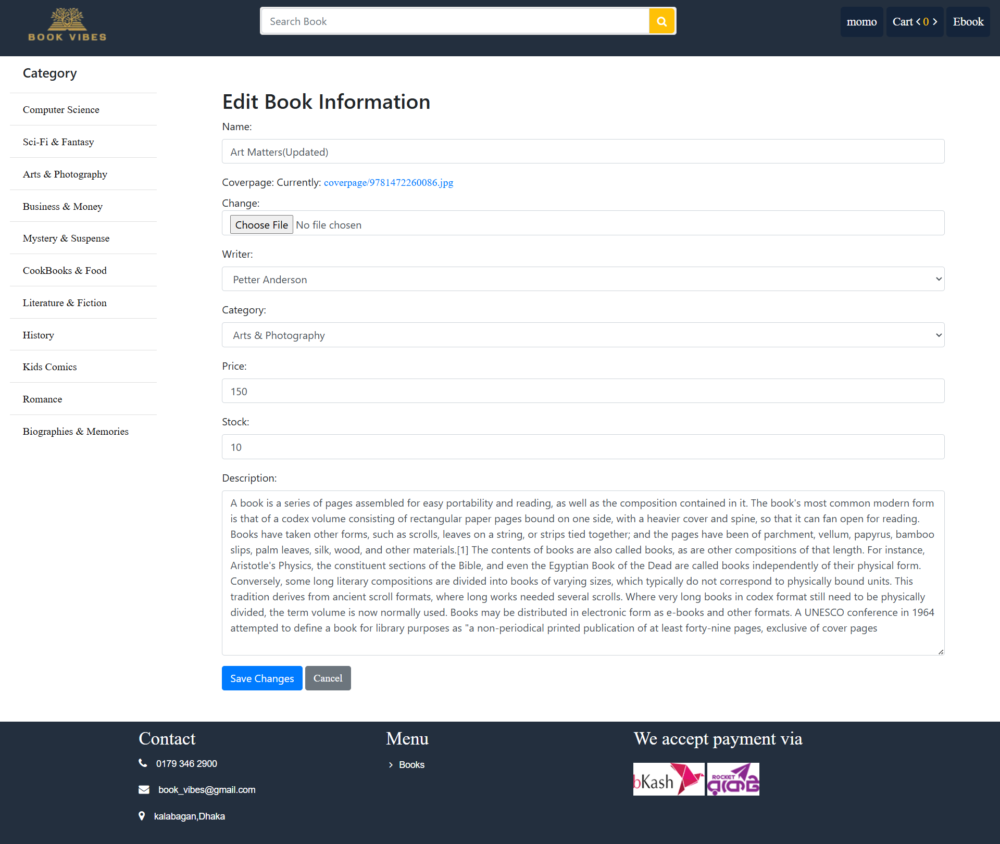

### 📤 Update E-book  
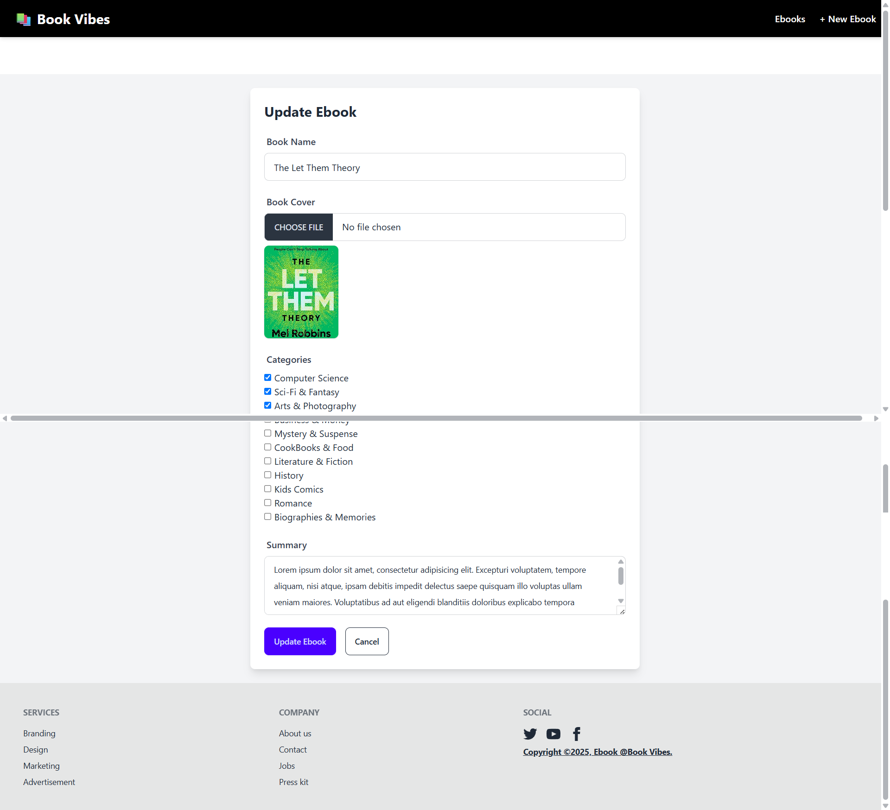

---


## 📂 Project Structure

```
Book_Vibes/
├── bookstore/       # Core application
├── cart/            # Shopping cart functionalities
├── ebook/           # E-book management
├── files/           # Static and media files
├── order/           # Order processing
├── search/          # Search functionalities
├── store/           # Storefront views
├── templates/       # HTML templates
├── static/          # Static files (CSS, JS, Images)
├── screenshots/     # Screenshots used in README
├── db.sqlite3       # SQLite database
├── manage.py        # Django management script
├── requirements.txt # Python dependencies
└── README.md        # Project documentation
```

---

## 🖥️ Installation & Setup

1. **Clone the Repository:**

   ```bash
   git clone https://github.com/mahiamOmO/Book_Vibes.git
   cd Book_Vibes
   ```

2. **Create a Virtual Environment:**

   ```bash
   python -m venv env
   source env/bin/activate  # On Windows: env\Scripts\activate
   ```

3. **Install Dependencies:**

   ```bash
   pip install -r requirements.txt
   ```

4. **Apply Migrations:**

   ```bash
   python manage.py migrate
   ```

5. **Run the Development Server:**

   ```bash
   python manage.py runserver
   ```

6. **Access the Application:**

   Open your browser and navigate to `http://localhost:8000/`

---

## 🧪 Testing

To run tests, use:

```bash
python manage.py test
```

---

## ✅ Usage

- **Register/Login:** Create an account or log in to access features.
- **Browse Books:** Explore the collection and view book details.
- **Add to Cart:** Select books and add them to your shopping cart.
- **Place Orders:** Proceed to checkout and confirm your orders.
- **Download E-books:** Access and download available e-books.

---

<div align="center">

## 👨‍💻 Developed By

<table>
  <tr>
    <td align="center" style="padding: 10px;">
      <br>
      <strong>Mahia Akter Momo</strong><br>
      <em>Team Leader</em><br>
      <a href="https://github.com/mahiamOmO" target="_blank">GitHub</a> | 
      <a href="https://www.linkedin.com/in/mahiamomo12/" target="_blank">LinkedIn</a>
    </td>
    <td align="center" style="padding: 10px;">
      <br>
      <strong>Md Kamrul Hasan</strong><br>
      <em>Team Member 1</em><br>
      <a href="https://github.com/KamrulHasan-creator" target="_blank">GitHub</a> | 
      <a href="https://www.linkedin.com/in/kamrul-hasan-a30a6633b/" target="_blank">LinkedIn</a>
    </td>
    <td align="center" style="padding: 10px;">
      <br>
      <strong>Farzana Hossain Popy</strong><br>
      <em>Team Member 2</em><br>
      <a href="https://github.com/Farzana-Popy" target="_blank">GitHub</a> | 
      <a href="https://www.linkedin.com/in/farzana-hossain-popy/" target="_blank">LinkedIn</a>
    </td>
  </tr>
</table>

</div>


---


## 📄 License

This project is licensed under the [MIT License](LICENSE).

<div align="center">
  <a href="https://www.buymeacoffee.com/mahiamomo" target="_blank">
    <em>
      
    </em>
  </a>
  <h3><em>✨ Happy Coding! ❤️ ✨</em></h3>
</div>

